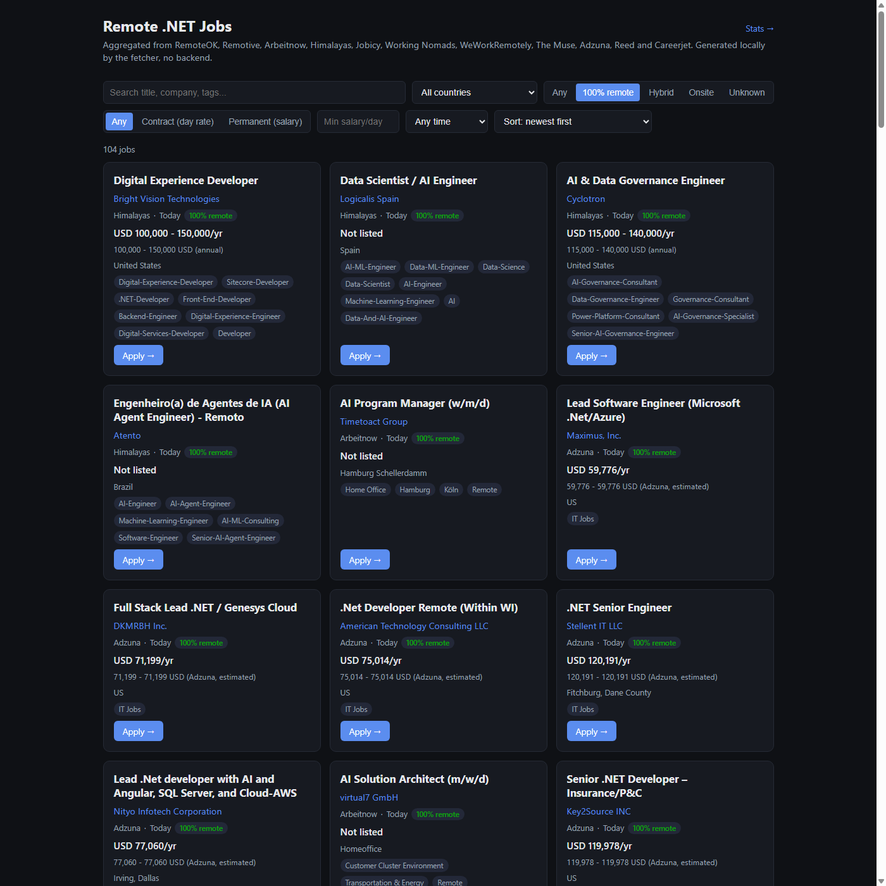
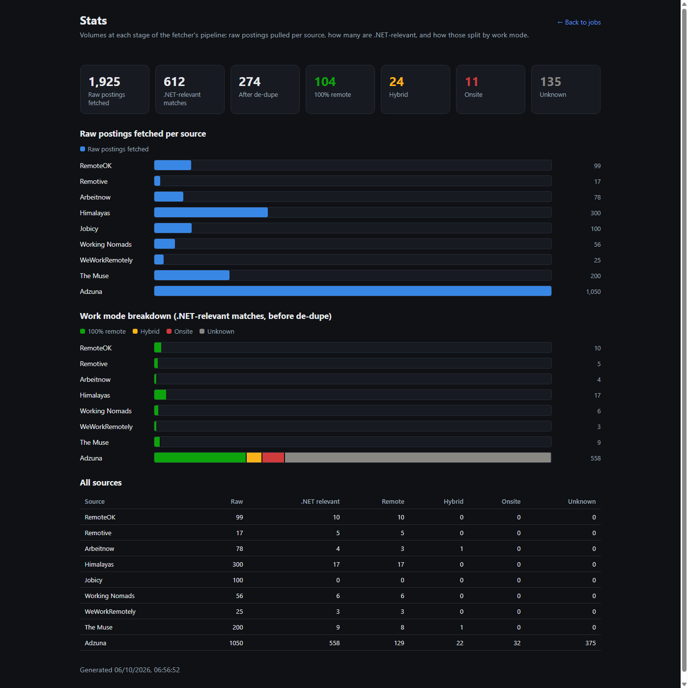

# Created a Job Board Because I Was Tired of Lying Job Boards

100% remote gigs. That's the whole pitch. Not "remote-friendly," not "remote considered,"
not a listing that says remote in the title and "3 days in the Leeds office" in paragraph
four. Contract and permanent .NET work, genuinely remote, pulled from a range of sources
into one page - closer to the truth than any single board gives you, even if it's not
perfect yet.

I built it because I kept getting burned by the alternative.
<p style="text-align: center">~</p>

## The Itch

Every general job board treats "remote" as a vibe rather than a fact. You search, you get
forty results, and twenty of them are hybrid roles that just happen to mention remote
somewhere in the copy. Multiply that across the boards you'd need to check to get real
coverage and the search itself becomes the job.

I didn't sit down to build a platform. I sat down to stop doing that by hand. A console app,
a handful of free job APIs, a static page to search what came out the other end.

Most of it got built talking it through with Claude Code rather than writing every adapter
myself line by line - "add a filter for hybrid vs onsite," "widen the range, pull back more
jobs" - working through each source one at a time until the shape of the thing settled.
<p style="text-align: center">~</p>

## What It Actually Does

- Pulls from eleven sources - RemoteOK, Remotive, Arbeitnow, Himalayas, Jobicy, Working
  Nomads, WeWorkRemotely, The Muse, Adzuna, Reed and Careerjet. Eight need no API key at all;
  three need a free one you register for yourself.
- Matches on `.NET`/`C#`/`ASP.NET`/`Blazor` **or** AI/ML terms - `LLM`, `generative AI`,
  `machine learning`, `agentic AI` - as two separate categories, not an intersection. A pure
  AI role with nothing .NET about it counts too, which matters more to me now than it would
  have a couple of years ago.
- Only matches on the title and tags, never the description. Staffing boards pad every
  single listing with "...React, Golang, PHP, Vue, .NET..." regardless of what the role
  actually is, and that'll false-positive on roles with nothing to do with either category
  if you let the description in.
- Tags every match with a work mode - 100% remote, hybrid, onsite, or unknown - rather than
  silently dropping anything that isn't remote. First version of this only surfaced 5 jobs,
  and I didn't know why until I built a Stats page to look. Out of 582 raw postings that run,
  13 were genuinely relevant after dedupe. The filter wasn't broken. Remote .NET roles are
  just a thin slice of any given day's market, and now the tool shows you that instead of
  hiding it.
- No backend, no database. Writes a flat `jobs.json` + `stats.json`, reads them client-side.
  Point any static host at the output folder, or run a one-line local server.
<p style="text-align: center">~</p>

## Two Pages, Nothing Else

There's the search page - title, company, tags, search box, country/work-mode/comp filters,
sorted newest first by default:



And there's a Stats page, linked off the top of that one, that exists purely because the "only
5 jobs" moment demanded an answer. Raw postings per source, how many clear the relevance bar,
and how those split by work mode - a funnel, not just a final number:



That's the whole surface area. No settings page, no accounts, nowhere else to click.
<p style="text-align: center">~</p>

## Why Non-Remote Jobs Are In Here Too

The obvious move for a "100% remote" tool is to just throw away anything that isn't. That's
what the first version did, and it's also what made it nearly useless - 5 jobs on a good day,
with no way to tell whether that was the filter being strict or the market actually being
that thin.

Keeping hybrid and onsite postings, tagged rather than deleted, answers that question. The
Stats page can only show "582 raw, 13 relevant, 5 remote" because the other work modes are
still sitting in the data instead of having been thrown away before anyone got to see them.
It also costs nothing on the default view - 100% remote is still the default filter, and
nothing that used to show up has stopped showing up. The tool just stopped quietly lying by
omission about everything else that's actually out there.

I'd rather show the full picture and let a filter do the hiding than decide on your behalf
what you don't get to see.
<p style="text-align: center">~</p>

## The One Decision Worth Explaining

Work mode used to be a hard filter - hybrid and onsite roles just got thrown away before
you ever saw them. Now it's a classifier instead, and every match gets kept and tagged:

```csharp
public static WorkMode Classify(RemoteTrust trust, string combinedText)
{
    if (trust == RemoteTrust.TrustedRemoteOnly) return WorkMode.Remote;

    if (LooksHybrid(combinedText)) return WorkMode.Hybrid;
    if (LooksOnsite(combinedText)) return WorkMode.Onsite;

    if (trust == RemoteTrust.TruncatedDescription) return WorkMode.Unknown;

    if (trust == RemoteTrust.RequiresExplicitRemoteMatch)
        return LooksExplicitlyRemote(combinedText) ? WorkMode.Remote : WorkMode.Unknown;

    return WorkMode.Remote;
}
```

Every source carries a trust tier. Boards like RemoteOK and Himalayas are remote-only by
nature, nothing to check. A general board like Reed has to positively say "remote," not just
avoid saying "hybrid." Adzuna and Careerjet get a stricter tier again - more on why below -
that never resolves to `Remote` at all, only `Hybrid`, `Onsite`, or `Unknown`. What used to
be instant rejection for all of these is now just a tag, which is the only reason the
work-mode filter and the Stats page can exist at all - you can't show hybrid/onsite volume
for data you already threw away.
<p style="text-align: center">~</p>

## The RegEx's Doing All the Work

If this were more fancy, an AI/LLM call or agent could do this classification work instead.
In the interests of simplicity and minimal dependencies, a few regular expressions are used.

Relevance is one pattern, .NET and AI/ML terms as alternatives rather than two filters ANDed
together:

```csharp
private static readonly Regex Pattern = new(
    @"(?<![a-z0-9])(\.net\b|asp\.net\b|dotnet\b|blazor\b|c#|ai\b|llm\b|genai\b|nlp\b|machine learning|generative ai|artificial intelligence|agentic ai|ml engineer)",
    RegexOptions.IgnoreCase | RegexOptions.Compiled);
```

The leading `(?<![a-z0-9])` is doing real work: none of the alternatives has its own leading
`\b`, just a trailing one, so `ai\b` alone would match the tail end of Dubai, Mumbai,
Chennai, Shanghai - city names ending in those two letters. The lookbehind closes that off.

Work mode runs on three more patterns - hybrid, onsite, and an explicit-remote check with a
negative lookahead so a company "developing remote monitoring systems" doesn't get read as
offering a remote job:

```csharp
private static readonly Regex HybridPattern = new(
    @"\bhybrid\b|\b(?:\d+|once|twice|one|two|three|four|five|six)\s*(?:times?|days?)?\s*(?:a|per|/)\s*week\b",
    RegexOptions.IgnoreCase | RegexOptions.Compiled);

private static readonly Regex OnsitePattern = new(
    @"\bon[\s-]?site\b|\bin[\s-]office\b|\bbased\s+(?:at|in)\s+(?:their|our|the)?\s*(?:site|office)\b|\b(?:office|site)[\s-]based\b",
    RegexOptions.IgnoreCase | RegexOptions.Compiled);

private static readonly Regex ExplicitRemotePattern = new(
    @"\bremote\b(?!\s+(?:monitoring|sensing|control|access|support|management|desktop|connectivity|devices?|systems?|session))|\bwork\s*from\s*home\b|\bwfh\b|\bremote[\s-]first\b",
    RegexOptions.IgnoreCase | RegexOptions.Compiled);
```

Simple to read, cheap to run - no API calls, no tokens, no network dependency. Just text in,
a tag out.
<p style="text-align: center">~</p>

## Bolting On a New Source

This is the part I actually designed for, because I knew day one that eleven sources
wouldn't be the last number. The whole thing hinges on one small interface:

```csharp
public interface IJobSourceAdapter
{
    string SourceName { get; }
    Task<List<JobPosting>> FetchAsync(HttpClient http, CancellationToken ct);
}
```

Adding a source means three things, and none of them touch the pipeline:

1. Write a class that implements it - hit the API, map whatever shape it gives you onto the
   shared `JobPosting` model (title, company, location, tags, salary if it has one).
2. Pick a `RemoteTrust` tier. Remote-only board, no office jobs mixed in? `TrustedRemoteOnly`.
   Remote-focused but could carry the odd hybrid listing? `AssumedRemoteUnlessFlagged`.
   General board that covers ordinary office jobs too? `RequiresExplicitRemoteMatch`. Does
   that general board's API also truncate descriptions, so you can't fully trust an explicit
   "remote" mention either? `TruncatedDescription` - the one that learned that lesson the
   hard way.
3. Add one line to the adapter list in `Program.cs`.

That's it. Relevance matching, dedupe, work-mode classification, the Stats page - none of
it knows or cares where a `JobPosting` came from. It was built against RemoteOK's shape
first, then proven against nine more completely different ones, so by the time Careerjet
went in it was genuinely just steps 1 through 3 above, not a redesign.
<p style="text-align: center">~</p>

## Where It's At

It's .NET 9 now, pulls from more countries than it used to, and does what I actually need:
real relevance, an honest answer on work mode, nothing hidden. MIT-licensed, sitting in a
git repo on my machine. Open source shortly.
<p style="text-align: center">~</p>

## The Part Worth Being Honest About

"Vibed it with Claude" undersells what actually happened here. The useful parts weren't code
generation, they were research done out loud before I let anything get written:

- Before trusting a new filtering idea, we ran it against live data instead of guessing.
  Loosening the relevance match to include descriptions sounded reasonable. Every single
  match it would have added turned out to be a false positive - recruiter boilerplate, or a
  company's "stack we happen to use somewhere" blurb nowhere near the actual role.
- "Widen the range" meant actually probing each source's API rather than assuming more pages
  would just work. Himalayas silently caps its `limit` param at 20 no matter what you ask
  for. Arbeitnow returns 250 results a page, not the ~16 the original adapter implied. Adzuna
  already covers 18 country indices under the same free key, and the US alone turned out to
  have roughly 12x the matching volume of the UK.
- Adding Careerjet surfaced a detail worth knowing before it bites you: it requires
  whitelisting your server's outbound IP in their dashboard before a single call works, no
  API to do that for you. Code that's technically correct and still 403s forever for a reason
  that has nothing to do with the code.
- A real job came through tagged 100% remote that wasn't - "WFH" in the title, "joining
  colleagues in the office twice a week" buried further down. The quick fix was real: the
  hybrid detector only caught digit day-counts ("3 days a week"), not word-form ones ("twice
  a week"). But the actual cause took more digging than the fix did. Adzuna's search API
  truncates every description to about 500 characters - for a lot of postings, the
  disqualifying detail isn't just missed, it was never in the data we had access to at all.
  Same job came back a second time on a later run, still wrong, which answered the follow-up
  question before I had to ask it: was the regex fix actually enough? No. So Adzuna (and
  Careerjet, same risk, unconfirmed) stopped being allowed to resolve to `Remote` at all -
  worst case now is a real remote role sitting in `Unknown` instead of a hybrid role lying in
  `Remote`, and for a tool whose entire pitch is not lying about "remote," that's the right
  side to be wrong on.

What hasn't changed is judgement - deciding what's worth checking, what trade-off is
actually fine, what "it works" needs to mean before you believe it. That part just moved
downstream, from writing the first draft to verifying what got built does what it claims.
<p style="text-align: center">~</p>

<div class="summary-section">

Enjoy what you've read, have questions about this content, or would like to see another topic
covered?

You can schedule a call using my [Calendly link](https://calendly.com/jamiemaguire) to
discuss consulting and development services.
<p style="text-align: center">~</p>

## Courses

Check my AI courses. From developers to decision makers, these have you covered:

- [Developing an Artificial Intelligence Strategy for Your Organization](https://www.pluralsight.com/courses/developing-artificial-intelligence-strategy-organization)
- [Aligning Generative AI with Business Cases](https://app.pluralsight.com/library/courses/aligning-generative-ai-business-cases/table-of-contents)
- [Vector Databases & Embeddings for Developers](https://app.pluralsight.com/ilx/video-courses/developers-vector-databases-embeddings/course-overview)

</div>
<p style="text-align: center">~</p>
